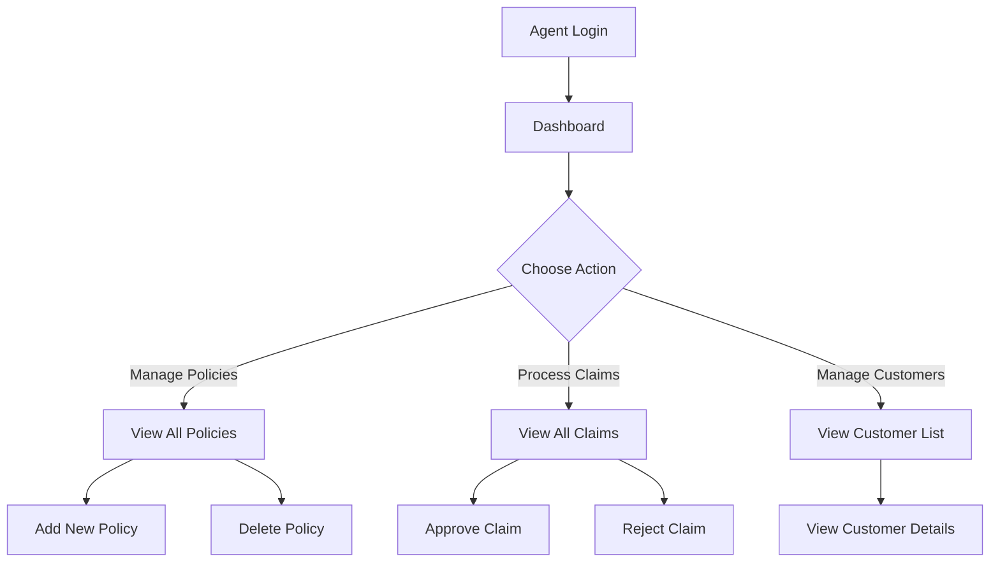
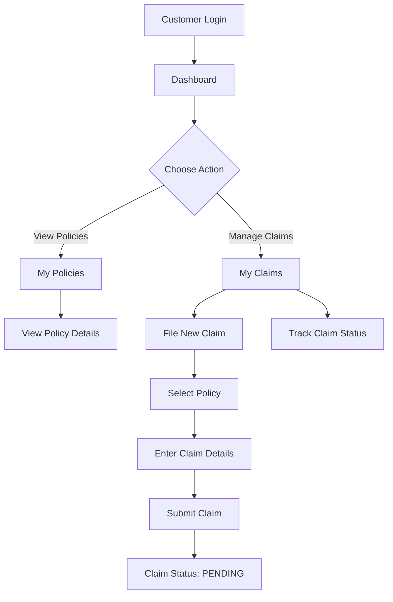
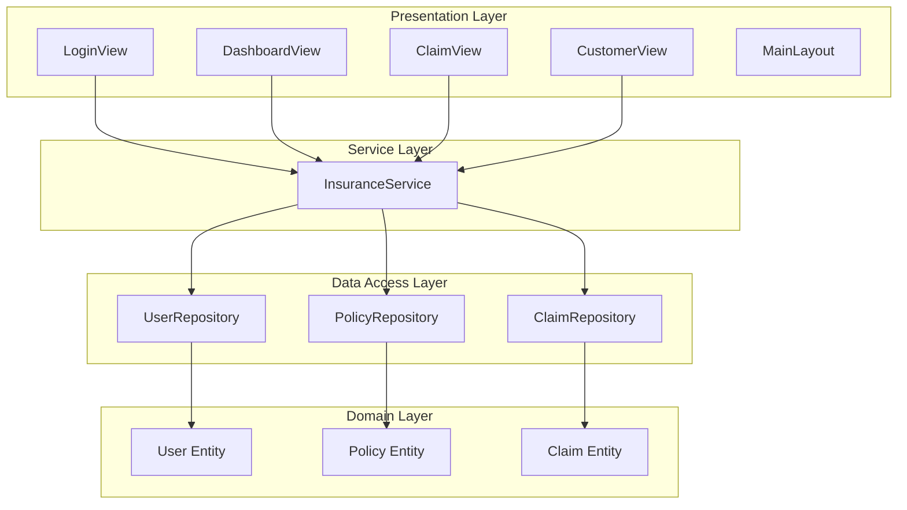
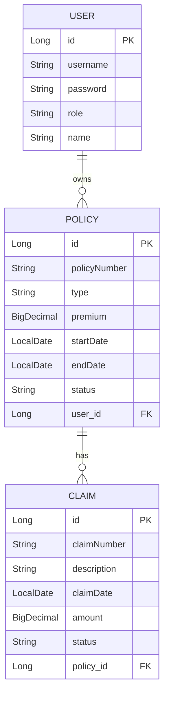

# Insurance Policy Management System - Project Documentation

## 📋 Table of Contents
1. [Project Overview](#project-overview)
2. [Features & Capabilities](#features--capabilities)
3. [User Roles & Workflows](#user-roles--workflows)
4. [Technical Architecture](#technical-architecture)
5. [Database Schema](#database-schema)
6. [Implementation Details](#implementation-details)
7. [How to Run](#how-to-run)
8. [User Guide](#user-guide)

---

## 🎯 Project Overview

The **Insurance Policy Management System** is a web-based application built with **Spring Boot** and **Vaadin** that enables insurance agents and customers to manage insurance policies and claims efficiently.

### Key Highlights
- **Role-Based Access Control**: Separate interfaces for Agents and Customers
- **Policy Management**: Create, view, and manage insurance policies
- **Claims Processing**: File, track, and process insurance claims
- **Real-time Updates**: Interactive UI with instant feedback
- **In-Memory Database**: H2 database for quick setup and testing

---

## ✨ Features & Capabilities

### 🔐 Authentication System
- **Login Page**: Secure authentication for both Agents and Customers
- **Session Management**: User sessions maintained throughout the application
- **Default Credentials**:
  - Agent: `agent` / `password`
  - Customer: `user` / `password`

### 📊 Dashboard (Policy Management)
**For Agents:**
- View **all policies** across all customers
- **Create new policies** with details:
  - Policy Number
  - Policy Type (AUTO, HOME, LIFE, etc.)
  - Premium Amount
  - Start/End Dates
  - Status (ACTIVE, EXPIRED, etc.)
- **Delete policies** from the system
- Full administrative control

**For Customers:**
- View **only their own policies**
- Track policy details and status
- Read-only access to policy information

### 🎫 Claims Management
**For Customers:**
- **File new claims** against their policies
- Provide claim details:
  - Claim Number
  - Description of incident
  - Claim Amount
  - Associated Policy
- **Track claim status**: PENDING, APPROVED, or REJECTED
- View claim history

**For Agents:**
- View **all claims** from all customers
- **Approve or Reject** pending claims
- Process claims with one-click actions
- Monitor claim status across the system

### 👥 Customer Management
**For Agents:**
- View list of all customers
- Access customer information
- Manage customer accounts

---

## 👤 User Roles & Workflows

### Agent Workflow



**Agent Capabilities:**
1. **Login** with agent credentials
2. **Dashboard Access**: See all policies in the system
3. **Create Policies**: Add new insurance policies for customers
4. **Delete Policies**: Remove policies from the system
5. **Claims Processing**: 
   - View all pending claims
   - Approve or reject claims
6. **Customer Management**: View and manage customer accounts

---

### Customer Workflow



**Customer Capabilities:**
1. **Login** with customer credentials
2. **Dashboard Access**: View only their own policies
3. **View Policies**: See policy details, premiums, dates, and status
4. **File Claims**:
   - Select a policy to claim against
   - Provide claim number and description
   - Enter claim amount
   - Submit for agent review
5. **Track Claims**: Monitor claim status (PENDING → APPROVED/REJECTED)

---

## 🏗️ Technical Architecture

### Technology Stack

| Layer | Technology | Purpose |
|-------|-----------|---------|
| **Frontend** | Vaadin 24.3.0 | Java-based UI framework |
| **Backend** | Spring Boot 3.4.12 | Application framework |
| **Database** | H2 (In-Memory) | Data persistence |
| **ORM** | Spring Data JPA | Database operations |
| **Build Tool** | Maven | Dependency management |
| **Java Version** | Java 17 | Runtime environment |

### Application Architecture



### Project Structure

```
abhihsek/
├── src/main/java/com/example/abhihsek/
│   ├── AbhihsekApplication.java          # Main Spring Boot application
│   ├── config/
│   │   └── DataInitializer.java          # Loads sample data on startup
│   ├── entity/
│   │   ├── User.java                     # User entity (Agent/Customer)
│   │   ├── Policy.java                   # Insurance policy entity
│   │   └── Claim.java                    # Insurance claim entity
│   ├── repository/
│   │   ├── UserRepository.java           # User data access
│   │   ├── PolicyRepository.java         # Policy data access
│   │   └── ClaimRepository.java          # Claim data access
│   ├── service/
│   │   └── InsuranceService.java         # Business logic layer
│   └── ui/
│       ├── LoginView.java                # Login page
│       ├── DashboardView.java            # Policy management page
│       ├── ClaimView.java                # Claims management page
│       ├── CustomerView.java             # Customer management page
│       └── MainLayout.java               # Application layout with navigation
└── src/main/resources/
    └── application.properties             # Application configuration
```

---

## 💾 Database Schema

### Entity Relationships



### Entity Details

#### User Entity
- **Purpose**: Stores user accounts (Agents and Customers)
- **Fields**:
  - `id`: Primary key (auto-generated)
  - `username`: Unique login identifier
  - `password`: User password (plain text for demo)
  - `role`: User role ("AGENT" or "CUSTOMER")
  - `name`: Display name

#### Policy Entity
- **Purpose**: Represents insurance policies
- **Fields**:
  - `id`: Primary key (auto-generated)
  - `policyNumber`: Unique policy identifier
  - `type`: Policy type (AUTO, HOME, LIFE, etc.)
  - `premium`: Monthly/annual premium amount
  - `startDate`: Policy start date
  - `endDate`: Policy expiration date
  - `status`: Policy status (ACTIVE, EXPIRED, etc.)
  - `user`: Reference to the policy owner (Customer)

#### Claim Entity
- **Purpose**: Represents insurance claims filed by customers
- **Fields**:
  - `id`: Primary key (auto-generated)
  - `claimNumber`: Unique claim identifier
  - `description`: Claim description/reason
  - `claimDate`: Date claim was filed
  - `amount`: Claim amount requested
  - `status`: Claim status (PENDING, APPROVED, REJECTED)
  - `policy`: Reference to the associated policy

---

## 🔧 Implementation Details

### 1. Authentication Flow

**File**: [`LoginView.java`](file:///c:/Users/91797/OneDrive/Desktop/Antigravity/abhihsek/src/main/java/com/example/abhihsek/ui/LoginView.java)

```java
// User enters credentials
User user = service.authenticate(username, password);

// If valid, store in session and navigate to dashboard
if (user != null) {
    VaadinSession.getCurrent().setAttribute(User.class, user);
    UI.getCurrent().navigate("dashboard");
}
```

**How it works:**
1. User enters username and password
2. `InsuranceService.authenticate()` validates credentials
3. On success, user object is stored in Vaadin session
4. User is redirected to the dashboard
5. All subsequent views check session for current user

---

### 2. Role-Based Access Control

**Implementation**: Each view checks the current user's role and adjusts the UI accordingly.

**Example from DashboardView**:
```java
if ("AGENT".equals(currentUser.getRole())) {
    // Show "Add Policy" button for agents
    Button addBtn = new Button("Add Policy", e -> openAddDialog());
    add(addBtn);
    
    // Show all policies
    grid.setItems(service.getAllPolicies());
} else {
    // Customers see only their policies
    grid.setItems(service.getPoliciesForUser(currentUser.getUsername()));
}
```

---

### 3. Policy Management

**File**: [`DashboardView.java`](file:///c:/Users/91797/OneDrive/Desktop/Antigravity/abhihsek/src/main/java/com/example/abhihsek/ui/DashboardView.java)

**Agent Actions:**
- **Create Policy**: Opens dialog with form fields
- **Delete Policy**: Removes policy from database
- **View All Policies**: Displays grid with all policies

**Customer Actions:**
- **View Policies**: Read-only grid showing only their policies

**Service Methods Used:**
- `getAllPolicies()`: Returns all policies (for agents)
- `getPoliciesForUser(username)`: Returns user-specific policies (for customers)
- `savePolicy(policy)`: Creates or updates a policy
- `deletePolicy(id)`: Removes a policy

---

### 4. Claims Processing

**File**: [`ClaimView.java`](file:///c:/Users/91797/OneDrive/Desktop/Antigravity/abhihsek/src/main/java/com/example/abhihsek/ui/ClaimView.java)

**Customer Workflow:**
1. Click "File Claim" button
2. Select a policy from dropdown (only their policies)
3. Enter claim details (number, description, amount)
4. Submit claim with status "PENDING"

**Agent Workflow:**
1. View all claims in the system
2. See "Approve" and "Reject" buttons for pending claims
3. Click button to update claim status
4. System saves updated claim and refreshes grid

**Service Methods Used:**
- `getAllClaims()`: Returns all claims (for agents)
- `getClaimsForUser(username)`: Returns user-specific claims (for customers)
- `saveClaim(claim)`: Creates or updates a claim

---

### 5. Data Initialization

**File**: [`DataInitializer.java`](file:///c:/Users/91797/OneDrive/Desktop/Antigravity/abhihsek/src/main/java/com/example/abhihsek/config/DataInitializer.java)

On application startup, the system automatically creates:
- **Agent Account**: username `agent`, password `password`
- **Customer Account**: username `user`, password `password`
- **Sample Policy**: POL-001, AUTO type, $1200 premium, assigned to customer

This allows immediate testing without manual data entry.

---

### 6. Navigation & Layout

**File**: [`MainLayout.java`](file:///c:/Users/91797/OneDrive/Desktop/Antigravity/abhihsek/src/main/java/com/example/abhihsek/ui/MainLayout.java)

The application uses a consistent layout with:
- **Header**: Application title
- **Navigation Menu**: Links to Dashboard, Claims, Customers (role-based)
- **Content Area**: Dynamic view content
- **Logout**: Session termination

Navigation is role-aware:
- Agents see: Dashboard, Claims, Customers
- Customers see: Dashboard, Claims

---

## 🚀 How to Run

### Prerequisites
- Java 17 or higher
- Maven 3.6+

### Steps

1. **Navigate to project directory**:
   ```bash
   cd c:\Users\91797\OneDrive\Desktop\Antigravity\abhihsek
   ```

2. **Build the project**:
   ```bash
   mvn clean install
   ```

3. **Run the application**:
   ```bash
   mvn spring-boot:run
   ```

4. **Access the application**:
   - Open browser: `http://localhost:8080`
   - Login as Agent: `agent` / `password`
   - Login as Customer: `user` / `password`

5. **Access H2 Console** (optional):
   - URL: `http://localhost:8080/h2-console`
   - JDBC URL: `jdbc:h2:mem:insurance`
   - Username: `sa`
   - Password: `password`

---

## 📖 User Guide

### For Agents

#### Managing Policies
1. Login with agent credentials
2. Navigate to **Dashboard**
3. Click **"Add Policy"** to create a new policy
4. Fill in policy details and click **"Save"**
5. To delete a policy, click **"Delete"** button in the grid

#### Processing Claims
1. Navigate to **Claims** from the menu
2. View all pending claims
3. Click **"Approve"** to approve a claim
4. Click **"Reject"** to reject a claim
5. Processed claims cannot be modified

#### Managing Customers
1. Navigate to **Customers** from the menu
2. View list of all registered customers
3. See customer details and associated policies

---

### For Customers

#### Viewing Policies
1. Login with customer credentials
2. Dashboard shows all your active policies
3. View policy details: number, type, premium, dates, status

#### Filing Claims
1. Navigate to **Claims** from the menu
2. Click **"File Claim"** button
3. Select the policy you want to claim against
4. Enter claim details:
   - Claim Number (e.g., CLM-001)
   - Description of incident
   - Claim amount
5. Click **"Submit"**
6. Claim status will be "PENDING" until agent reviews

#### Tracking Claims
1. Navigate to **Claims** from the menu
2. View all your filed claims
3. Check status: PENDING, APPROVED, or REJECTED
4. See claim details and amounts

---

## 🔑 Key Configuration

### Application Properties

**File**: [`application.properties`](file:///c:/Users/91797/OneDrive/Desktop/Antigravity/abhihsek/src/main/resources/application.properties)

```properties
# Server runs on port 8080
server.port=8080

# H2 in-memory database
spring.datasource.url=jdbc:h2:mem:insurance
spring.datasource.username=sa
spring.datasource.password=password

# Auto-create database schema
spring.jpa.hibernate.ddl-auto=update

# Enable H2 console for debugging
spring.h2.console.enabled=true
spring.h2.console.path=/h2-console

# Vaadin configuration
vaadin.productionMode=false
```

---

## 📝 Summary

This Insurance Policy Management System demonstrates:

✅ **Full-stack Java development** with Spring Boot and Vaadin  
✅ **Role-based access control** with distinct Agent and Customer workflows  
✅ **CRUD operations** for policies and claims  
✅ **Relationship management** between Users, Policies, and Claims  
✅ **Session management** for user authentication  
✅ **Responsive UI** with real-time updates  
✅ **Clean architecture** with separation of concerns  

The application is production-ready for demonstration purposes and can be extended with additional features like:
- Password encryption
- Email notifications
- Document uploads
- Payment processing
- Advanced reporting
- Multi-factor authentication
